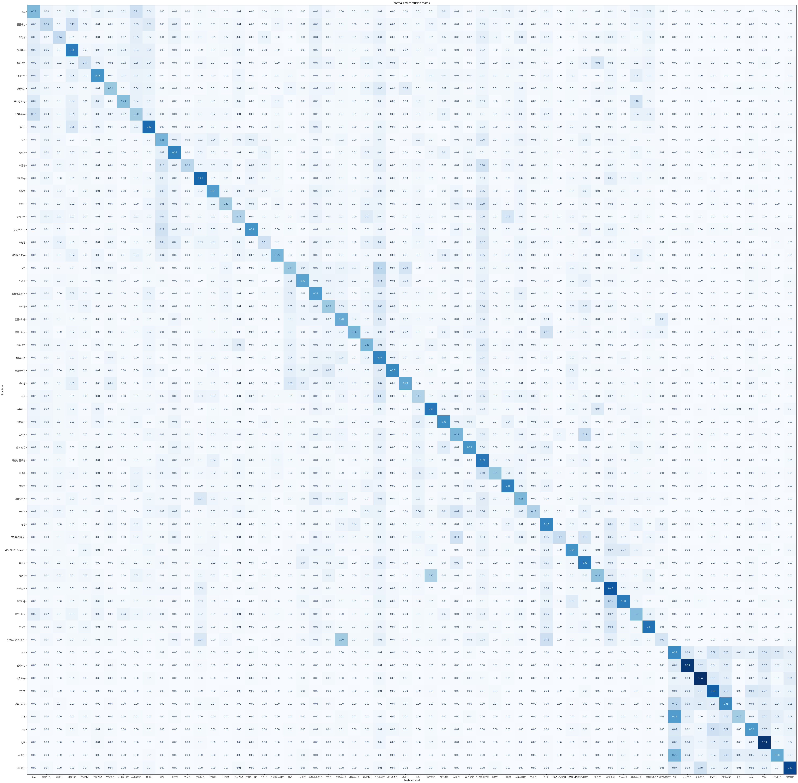

---
language:
- ko
library_name: transformers
pipeline_tag: text-classification
widget:
- text: 오늘 밥이 너무 맛있었어. 행복해
- text: 오늘 따라 저녁이 좀 맛있네.
- text: 직장에서 부당한 일을 겪어서 너무 화가 나
- text: 퇴직금으로 적립한 펀드 수익률이 많이 올랐어.
- text: 퇴직금으로 적립한 펀드 수익률이 많이 떨어졌어.
- text: 퇴직금으로 적립한 펀드 수익률이 많이 내려갔어.
- text: 우연히 남자친구가 헤어진 전 여자친구를 잊지 못했다는 걸 알았어.
license: cc-by-sa-4.0
metrics:
- f1
- accuracy
---

# 한국어 감정 분류모델
## 60가지의 세분화된 감정분류 모델
### Dataset: Aihub-감성대화말뭉치
### Dataset URL : https://aihub.or.kr/aihubdata/data/view.do?currMenu=115&topMenu=100&aihubDataSe=realm&dataSetSn=86

### model: hun3359/klue-bert-base-sentiment
### parent model: klue/bert-base
### parent model url: https://huggingface.co/klue/bert-base



** fine-tuning log ** 

distilbert-base-multilingual-cased을 5 epoch fine-tuning -->  acc: 0.25 (2023.08.08)

bongsoo/mdistilbertV3.1을 5 epoch fine-tuning -->  acc: 0.26 (2023.08.09)

klue/bert-base를 5 epoch fine-tuning --> see below results (2023.08.09)

- klue-bert-base-sentiment fine-tuning result 

```json
{
  "test_loss": 2.8668248653411865,
  "test_accuracy": 0.29371889480006863,
  "test_f1": 0.29102037288558685,
  "test_runtime": 50.8082,
  "test_samples_per_second": 458.745,
  "test_steps_per_second": 14.348
}
```

- klue-bert-base-sentiment config

```json
{
  "_name_or_path": "klue/bert-base",
  "architectures": [
    "BertForSequenceClassification"
  ],
  "attention_probs_dropout_prob": 0.1,
  "classifier_dropout": null,
  "hidden_act": "gelu",
  "hidden_dropout_prob": 0.1,
  "hidden_size": 768,
  "initializer_range": 0.02,
  "intermediate_size": 3072,
  "id2label":{
    "0": "분노",
    "1": "툴툴대는",
    "2": "좌절한",
    "3": "짜증내는",
    "4": "방어적인",
    "5": "악의적인",
    "6": "안달하는",
    "7": "구역질 나는",
    "8": "노여워하는",
    "9": "성가신",
    "10": "슬픔",
    "11": "실망한",
    "12": "비통한",
    "13": "후회되는",
    "14": "우울한",
    "15": "마비된",
    "16": "염세적인",
    "17": "눈물이 나는",
    "18": "낙담한",
    "19": "환멸을 느끼는",
    "20": "불안",
    "21": "두려운",
    "22": "스트레스 받는",
    "23": "취약한",
    "24": "혼란스러운",
    "25": "당혹스러운",
    "26": "회의적인",
    "27": "걱정스러운",
    "28": "조심스러운",
    "29": "초조한",
    "30": "상처",
    "31": "질투하는",
    "32": "배신당한",
    "33": "고립된",
    "34": "충격 받은",
    "35": "가난한 불우한",
    "36": "희생된",
    "37": "억울한",
    "38": "괴로워하는",
    "39": "버려진",
    "40": "당황",
    "41": "고립된(당황한)",
    "42": "남의 시선을 의식하는",
    "43": "외로운",
    "44": "열등감",
    "45": "죄책감의",
    "46": "부끄러운",
    "47": "혐오스러운",
    "48": "한심한",
    "49": "혼란스러운(당황한)",
    "50": "기쁨",
    "51": "감사하는",
    "52": "신뢰하는",
    "53": "편안한",
    "54": "만족스러운",
    "55": "흥분",
    "56": "느긋",
    "57": "안도",
    "58": "신이 난",
    "59": "자신하는"
  },
  "label2id": {
    "분노": 0,
    "툴툴대는": 1,
    "좌절한": 2,
    "짜증내는": 3,
    "방어적인": 4,
    "악의적인": 5,
    "안달하는": 6,
    "구역질 나는": 7,
    "노여워하는": 8,
    "성가신": 9,
    "슬픔": 10,
    "실망한": 11,
    "비통한": 12,
    "후회되는": 13,
    "우울한": 14,
    "마비된": 15,
    "염세적인": 16,
    "눈물이 나는": 17,
    "낙담한": 18,
    "환멸을 느끼는": 19,
    "불안": 20,
    "두려운": 21,
    "스트레스 받는": 22,
    "취약한": 23,
    "혼란스러운": 24,
    "당혹스러운": 25,
    "회의적인": 26,
    "걱정스러운": 27,
    "조심스러운": 28,
    "초조한": 29,
    "상처": 30,
    "질투하는": 31,
    "배신당한": 32,
    "고립된": 33,
    "충격 받은": 34,
    "가난한 불우한": 35,
    "희생된": 36,
    "억울한": 37,
    "괴로워하는": 38,
    "버려진": 39,
    "당황": 40,
    "고립된(당황한)": 41,
    "남의 시선을 의식하는": 42,
    "외로운": 43,
    "열등감": 44,
    "죄책감의": 45,
    "부끄러운": 46,
    "혐오스러운": 47,
    "한심한": 48,
    "혼란스러운(당황한)": 49,
    "기쁨": 50,
    "감사하는": 51,
    "신뢰하는": 52,
    "편안한": 53,
    "만족스러운": 54,
    "흥분": 55,
    "느긋": 56,
    "안도": 57,
    "신이 난": 58,
    "자신하는": 59
},
  "layer_norm_eps": 1e-12,
  "max_position_embeddings": 512,
  "model_type": "bert",
  "num_attention_heads": 12,
  "num_hidden_layers": 12,
  "pad_token_id": 0,
  "position_embedding_type": "absolute",
  "problem_type": "single_label_classification",
  "torch_dtype": "float32",
  "transformers_version": "4.30.2",
  "type_vocab_size": 2,
  "use_cache": true,
  "vocab_size": 32000
}
```